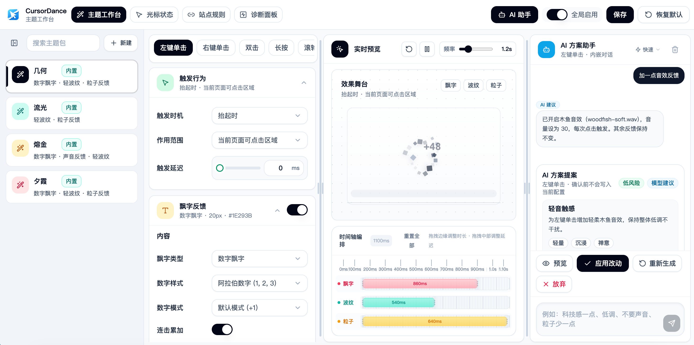
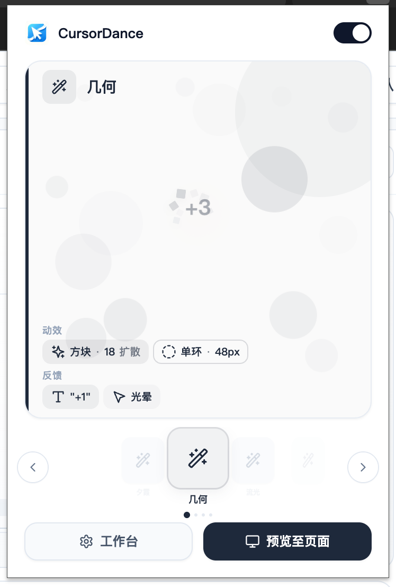

# CursorDance

<p align="center">
  
</p>

<p align="center">
  <a href="LICENSE"></a>
  <a href="https://github.com/Rvz1230/cursor-dance"></a>
  
  
</p>

CursorDance 为网页和桌面系统添加可定制的鼠标交互效果——点击粒子、波纹、飘字、音效、光标状态切换等。

- Chrome 扩展（Manifest V3）已上架，内容脚本在目标网页中渲染效果。
- Electron 桌面版正在开发，通过透明 overlay 和全局输入监听在操作系统桌面渲染效果。
- 两端复用 React 工作台、设计系统和 schema v3 配置模型；Popup 目前仅由 Chrome 扩展提供。

## 截图

<p align="center">
  
  <br><em>主题工作台 — 编辑动作配置、实时预览效果</em>
</p>

<p align="center">
  
  <br><em>Chrome 扩展 Popup 快速切换主题</em>
</p>

## 安装

### Chrome 应用商店

[](https://chromewebstore.google.com/detail/nckepaijkfcnnmmdllggalogfegpiepi?utm_source=item-share-cb)

> ✅ 已上架 — [点击安装](https://chromewebstore.google.com/detail/nckepaijkfcnnmmdllggalogfegpiepi?utm_source=item-share-cb)

### 手动安装（开发模式）

1. 使用 Node.js 22.12+，执行 `npm ci && npm run build`
2. 打开 `chrome://extensions`，开启「开发者模式」
3. 点击「加载已解压的扩展程序」，选择 `dist/` 目录
4. 打开任意网页即可看到效果；点击工具栏上的 CursorDance 图标打开 Popup

### 桌面版开发

```bash
nvm use
npm ci
npm run dev:electron
```

桌面安装包仍处于 dogfood 阶段；首个正式版本仅支持 macOS Apple Silicon。发布流程、所需签名凭据与失败回滚策略见 [macOS 首版发布与回滚](docs/desktop-release.md)。证书接入前不会发布 unsigned 正式版本。

## 功能

- **7 种触发动作**：左键单击、右键单击、双击、长按、滚轮、悬停、悬停离开
- **9 类反馈效果**：数字/文本飘字、粒子、波纹、音效、动画、图片贴纸、光标形状、氛围粒子、元素磁吸
- **5 种光标状态**：默认、手型、文本、等待、禁用——每种可独立绑定动作和光标图案
- **氛围效果（Chrome 扩展）**：自定义光标拖尾、氛围粒子、视差跟随，增强页面沉浸感
- **主题系统**：4 套内置主题 + 自定义主题的创建、复制、导入/导出
- **站点规则**：按域名独立配置启用/禁用、指定专属主题
- **AI 方案助手**：自然语言描述需求，自动生成效果配置
- **实时预览**：工作台 Live Preview 即时在目标网页上查看效果
- **Popup 快速切换（Chrome 扩展）**：工具栏弹窗一键切换主题，站点规则感知

## 技术栈

| 层 | 技术 |
|---|------|
| 共享工作台 + 扩展 Popup | React 18 + Vite + Tailwind CSS + Framer Motion |
| Chrome 扩展 | Manifest V3 + 原生 IIFE 内容脚本 |
| Electron 桌面端 | electron-vite + 透明 overlay + uiohook-napi |
| 状态管理 | useReducer + Chrome Storage / electron-store |
| 数据格式 | schema v3，主 key `cursordance.config` |
| 测试 | Vitest + Node test runner + Playwright smoke |
| AI API | Node.js + OpenAI Responses API 格式 → DeepSeek 模型 |

## 快速开始

```bash
# 安装锁定依赖（Node.js 22.12+）
npm ci

# 开发模式（Vite dev server，含 HMR）
npm run dev

# 运行单元测试
npm run test

# 生产构建 → dist/
npm run build

# 桌面端开发 / 构建
npm run dev:electron
npm run build:electron
```

### 在 Chrome 中加载

1. `npm run build`
2. 打开 `chrome://extensions`，开启「开发者模式」
3. 点击「加载已解压的扩展程序」，选择 `dist/` 目录
4. 打开任意网页，点击页面查看效果
5. 点击工具栏 CursorDance 图标打开 Popup

### AI 功能（可选）

```bash
# 启动 AI API 服务
npm run ai:dev
```

在工作台右侧面板使用自然语言描述效果需求。

## 架构

```
                     ┌──────────────────────┐
                     │  Shared React UI     │
                     │ Workbench + Popup    │
                     └──────────┬───────────┘
                                │ schema v3
                 ┌──────────────┴──────────────┐
                 │                             │
       ┌─────────▼─────────┐         ┌─────────▼─────────┐
       │ Chrome Extension  │         │ Electron Desktop  │
       │ chrome.storage    │         │ electron-store     │
       │ Content Scripts   │         │ Main / Preload     │
       │ DOM Events        │         │ Global Input IPC   │
       └─────────┬─────────┘         └─────────┬─────────┘
                 │                             │
       ┌─────────▼─────────┐         ┌─────────▼─────────┐
       │ IIFE Effect Engine│         │ TS Effect Engine  │
       │ inside web pages  │         │ transparent overlay│
       └───────────────────┘         └───────────────────┘
```

平台边界及同步约束详见 [`ARCHITECTURE.md`](./ARCHITECTURE.md)。扩展与桌面端目前各有一套效果引擎；修改一端时必须同步另一端，并通过 parity 测试锁定共享行为。

### 数据流

扩展端：

1. 用户在工作台编辑主题 → 保存到 `chrome.storage.local`（key: `cursordance.config`）
2. Live Preview → 写入 `chrome.storage.session`（key: `cursordance.livePreviewConfig`）
3. 内容脚本通过 `chrome.storage.onChanged` 监听变更 → `syncConfigFromStorage()` 同步配置
4. DOM 事件（pointerdown/up/move, wheel, contextmenu）→ `trigger-handlers.js` 解析动作配置 → `visual-effects.js` 渲染效果
5. Popup 读取配置并解析站点规则，显示实际生效的主题

桌面端：工作台通过 preload IPC 读写 `electron-store`；主进程捕获全局鼠标/键盘事件并广播给透明 overlay，overlay 使用 TypeScript 效果引擎渲染。应用规则根据当前前台应用决定是否启用及使用哪个主题。

## 项目结构

```
cursor-dance/
├── extension/                  # Chrome MV3 清单、配置与 IIFE 内容脚本
├── src/
│   ├── app/                    # 两端复用的 Workbench / Popup
│   ├── components/             # Radix + Tailwind 共享组件
│   ├── shared/                 # 运行环境、IPC、存储抽象
│   └── desktop/
│       ├── main/               # 生命周期、窗口、托盘、全局输入
│       ├── preload/            # contextBridge API
│       └── renderer/           # TS 引擎、overlay、Popup、工作台
├── cursor-dance-api/           # AI API 服务
├── landing/                    # 独立 Vite 落地页
├── electron.vite.config.mjs    # Electron 三进程构建配置
├── electron-builder.yml        # 桌面安装包与更新配置
├── vite.config.js              # 扩展 MPA 构建配置
├── ARCHITECTURE.md             # 平台边界
└── PROGRESS.md                 # 桌面版进度
```

## 配置数据格式

```js
{
  schemaVersion: 3,
  enabled: true,
  activeThemePackId: "mono-geo",
  themePacks: [{
    id: "mono-geo",
    name: "几何",
    cursorStates: { default: { mode: "inherit", size: 48 }, ... },
    workbenchDraft: {
      actionConfigs: {
        leftClick: { textEnabled: true, particle: true, ripple: true, sound: true, ... },
        rightClick: { ... },
        doubleClick: { ... },
        longPress: { ... },
        wheel: { ... },
        hover: { ... }
      }
    }
  }],
  siteRules: [
    { id: "r1", pattern: { type: "glob", value: "*.example.com" }, action: { enable: true, theme: "petal" } }
  ],
  performance: { maxActiveEffects: 48 }
}
```

## 命令行

```bash
npm run dev                     # Vite dev server（工作台 + Popup）
npm run build                   # 生产构建 → dist/
npm run test                    # Vitest 单元测试
npm run test:smoke              # Playwright E2E 冒烟测试
npm run extension:prepare-manifest  # 更新 manifest host_permissions
npm run ai:dev                  # AI API 服务
npm run dev:electron            # Electron 桌面端开发
npm run build:electron          # 构建 main / preload / renderer
npm run package:mac             # 生成 macOS 安装包（发布前需签名公证）
npm run package:ci              # 当前原生平台生成 CI 真实安装包
npm run verify:package          # 检查安装包结构、架构和更新元数据
npm run test:package            # 启动打包后的最终可执行文件做 smoke
```

桌面打包版会自动检查更新，但不会静默下载或退出时自动安装。发现新版本后，可在工作台标题栏确认下载，并在下载完成后主动重启安装。

## 贡献

欢迎提交 Issue 和 Pull Request。

1. Fork 本仓库
2. 创建特性分支 (`git checkout -b feat/amazing-feature`)
3. 提交修改 (`git commit -m 'feat: add amazing feature'`)
4. 推送到分支 (`git push origin feat/amazing-feature`)
5. 创建 Pull Request

提交信息请遵循 [Conventional Commits](https://www.conventionalcommits.org/zh-hans/) 规范（本项目使用 `feat:`、`fix:`、`refactor:`、`docs:`、`test:` 等前缀）。

开始开发前请阅读 [CLAUDE.md](./CLAUDE.md) 了解架构约定和项目规范。

## 许可证

本项目基于 **GNU Affero General Public License v3.0 (AGPL-3.0)** 发布。

- ✅ 你可以自由使用、修改、分发本软件
- ✅ 你可以将本软件用于商业目的
- ⚠️ 如果你修改了本软件并通过网络提供服务（包括作为 Web 应用或浏览器扩展），你必须公开你的修改后的完整源代码
- ⚠️ 所有衍生作品必须以相同的 AGPL-3.0 协议发布

完整协议文本见 [LICENSE](./LICENSE)。
